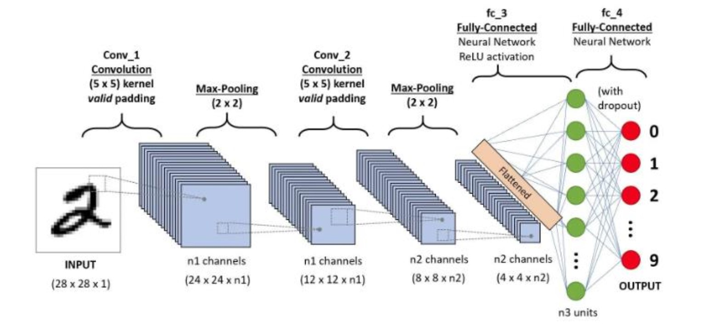
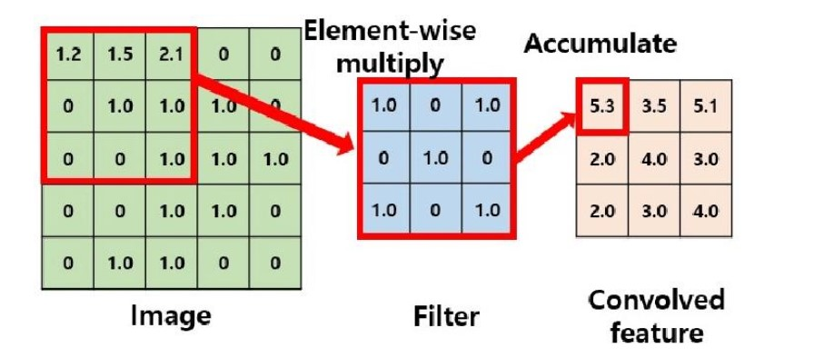

# Parallel CNN Layer Implementation in C (OpenMP)

## Overview

This project implements a simplified CNN-style computation pipeline entirely in C, including convolution, activation, and pooling operations. The main goal was not to build a full deep learning framework, but to understand how these operations behave at a low level and how they can be optimized on a multi-core CPU.

The program processes an input matrix with multiple kernels and generates corresponding output feature maps, mimicking a basic convolutional layer.

This project also explores the **practical limits of parallelization using OpenMP**, especially on consumer hardware.

---

## Background

Modern neural networks rely heavily on convolution operations, which are computationally expensive due to their nested loop structure. This makes them ideal candidates for parallelization.

In this project, all operations were implemented manually:

* no external ML libraries
* explicit memory management
* explicit loop-based computation

This allowed direct experimentation with:

* loop-level parallelism
* thread scaling
* cache/memory effects
* performance profiling tools

---

## Features

* 2D convolution implemented from scratch (stride = 1)
* Zero padding for boundary handling
* Sigmoid activation (element-wise)
* Max pooling (2x2, stride = 2)
* Dynamic memory allocation for matrix operations
* File-based input/output system
* OpenMP-based parallelization
* Performance analysis using `gprof` and `omp_get_wtime`

---

## Workflow

The program follows a simplified CNN pipeline:

1. Read input matrix from file
2. For each kernel:

   * Apply zero padding
   * Perform convolution
   * Apply sigmoid activation
   * Apply max pooling
3. Write output feature maps to files

---

## Build

make

## Run

./main

---

## Parallelization Strategy

Two levels of parallelization were explored:

### 1. Intra-kernel parallelism (effective)

The nested loops inside the convolution operation were parallelized:

#pragma omp parallel for collapse(2)

This significantly reduced execution time (≈3× speedup depending on thread count).

---

### 2. Inter-kernel parallelism (not effective)

An attempt was made to process multiple kernels simultaneously.

This resulted in worse performance due to:

* thread oversubscription
* memory contention
* limited CPU resources

---

## Performance Analysis

Profiling revealed that:

* Convolution is the dominant computational bottleneck
* Inner-loop parallelization provides the best performance gains
* Over-parallelization can degrade performance instead of improving it

### Example Results

* Serial execution: ~4.5 seconds
* Parallel convolution: ~1.3–1.5 seconds
* Fully parallel main execution: up to ~40 seconds (worse)

---

## Key Observations

* More threads ≠ better performance
* Parallelizing at the wrong level can slow down the program
* Memory access patterns become critical in multi-threaded workloads
* Consumer CPUs have limits that are easy to exceed with naive parallelization

---

## System

Tested on:

* CPU: Ryzen 5 5600H
* 6 cores / 12 threads

---

## Notes

* Uses square matrices for simplicity
* Designed as a low-level educational implementation rather than a production ML system

---

## Author

Mert Kaya
